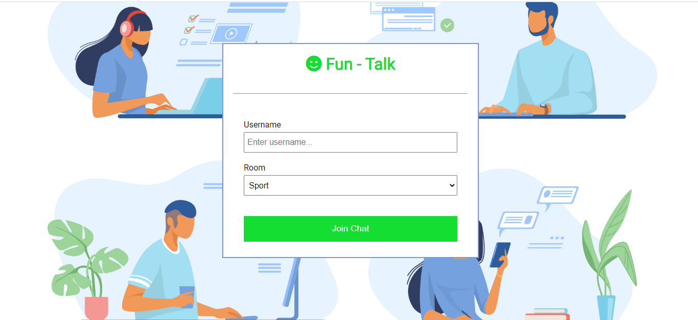

<h1 align="center"> 👤 Fun-Talk App  </h1>
Realtime chat app with websockets using Node.js, Express and Socket.io with Vanilla JS on the frontend with a custom UI

## 💻 &nbsp; Setup

To run this project, install it locally using npm:

***
1. First and foremost, open your terminal and type to clone this repository.
  ```
  git clone https://github.com/HiteshBucky/Real-Time-Chat-App.git
  ```
2. Install the necessary dependencies to your app by running 
  ```
  npm install
  ```
3. Launch the development build of the app, by running  
  ```
  npm start
  ```
4. Open your favourite browser and type
  ```
  http://localhost:3000/
  ```
Happy Coding :)
#
#
#
### <h2 align="center"> ⚡️⚡️⚡️ &nbsp; [Live Demo](https://funtalk.herokuapp.com/) &nbsp; ⚡️⚡️⚡️ </h2>

#
#
#
#
<h1 align="center"> 💻 Screenshoots  </h1>
#
#
          



#
#


#
#


